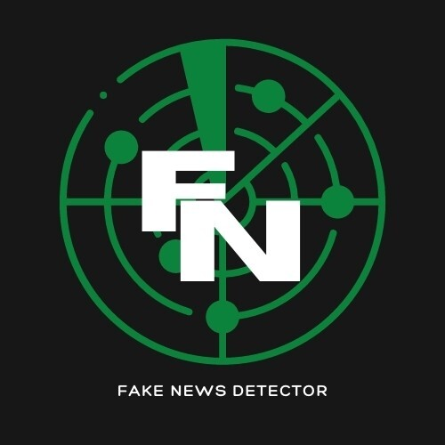

# “Fake News!” Detector

# Background and Motivation: 

In the age of social media, it has become more important than ever to be wary of what we read on all platforms. Social media has made it easier to connect with the world and has great influence on the masses as anyone can share anything. What we wanted to do was to find a way to weed out the real news from the fake news. And, more importantly, we wanted to find a way to measure the impact that fake news has on society as a whole.

# Questions to Answer:

  * Which news sites contribute the most “Fake" News?
  * Which news sites contribute to the most Real News?
  * Which is shared, liked and commented more, “Fake” or Real News? 
  * What are the most-used "words" in Fake News Vs. Real News?

# Outline 
 * Transform, Train & Test the Data
 * Result & Analysis 
 * Visualizations 
 * Web Page Creation 
 * Flask Rendering
 * Conclusion

# Technology
 * Machine Learning, NLP, Python, HTML/CSS/Bootstrap

# Data Resources

* [BBC](https://www.bbc.com/)
* [BuzzFeed Politics](https://www.buzzfeednews.com/section/politics)
* [Conservative Post]()
* [CNN](https://www.cnn.com/)
* [Daily Mail](https://www.dailymail.co.uk/ushome/index.html)
* [Facebook](https://www.facebook.com/)
* [Fox News](https://www.foxnews.com/)

### Data Analytics Team:
* [Miguel](https://github.com/52Godfrey) - Data collection, Data cleaning, Webscrape, Flask Rendering
* [Paola](https://github.com/paola1395) - Data manipulation, Machine Learning model creation, model testing, model training
* [Alicia](https://github.com/aliciasply) - Data cleaning, Data manipulation, Web page creation and visualizations in Python 
* [Medha](https://github.com/medha795) - Data cleaning, Data manipulation, Visualization in Python 

